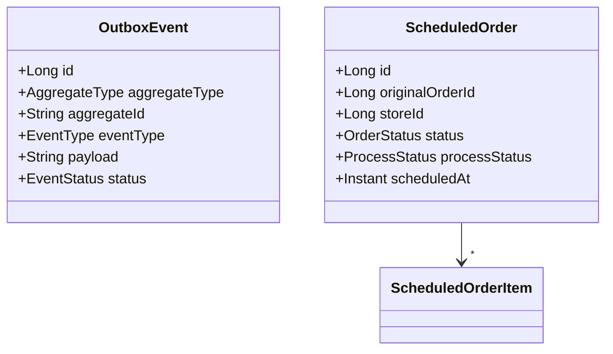

# Scheduler & Outbox Microservice

> **Purpose –** Executes **daily batch jobs** (Spring Batch) and guarantees **exact‑once publication** of domain events using the **Transactional Outbox** pattern for the **OrderHub** platform.

This service processes *scheduled orders* every midnight (KST) and emits `ORDER_SCHEDULED` events without losing messages, even in the face of crashes or retries.

---

## ✨ Key Responsibilities

1. **Scheduled Order Collection** – Persists snapshots of every order in `scheduled_orders` table (via Kafka listener).
2. **Nightly Processing** – At `00:00` (cron `0 0 0 * * *`) a Spring Batch job:

    * Reads yesterday’s `PENDING` scheduled orders (excluding cancelled).
    * Marks them as `PROCESSING`.
    * Writes an `inventory-deduct` event request to the *Outbox* table.
3. **Transactional Outbox** – `OutboxEvent` rows are saved in the same DB transaction as batch writes, ensuring atomicity. A separate generic publisher (not shown) polls and pushes to Kafka.

---

## 🏗️ Tech Stack

| Layer       | Technology                        |
| ----------- | --------------------------------- |
| Runtime     | **Java 17**, Spring Boot 3        |
| Batch       | **Spring Batch** (chunk‑oriented) |
| Persistence | Spring Data JPA, **MySQL 8**      |
| Messaging   | **Apache Kafka** (Outbox pattern) |
| Build       | Gradle 8, Docker Compose          |

---

## ⚙️ Batch Job Flow

```mermaid
graph TD
    subgraph Nightly Job (00:00)
        R[ItemReader: SELECT scheduled_orders<br/>where date=yesterday & status=PENDING]
        P[ItemProcessor:<br/>order.markAsProcessed()]
        W[ItemWriter:<br/>save orders + insert OutboxEvent]
    end
    R --> P --> W
```

* **Reader** – JPQL pulls yesterday’s orders using `BETWEEN` & `ProcessStatus.PENDING` filter.
* **Processor** – Sets `processStatus = PROCESSING` (business marker).
* **Writer** – Persists changes **and** builds an `InventoryDeductRequest`, wrapped as an `OutboxEvent` with `eventType = ORDER_SCHEDULED`.

---

## Domain Model Snapshots



---

## Event Contracts

| Topic                           | Payload                  | Trigger             |
| ------------------------------- | ------------------------ | ------------------- |
| `order-created`                 | `OrderEventRequest`      | Order service       |
| `order-updated`                 | `OrderEventRequest`      | Order service       |
| **Outbox → `inventory-deduct`** | `InventoryDeductRequest` | Scheduler batch job |

*Outbox publisher polls rows where `status = PENDING`, sends to Kafka, then sets `status = PUBLISHED` + `publishedAt`.*

---

## Running Locally

```bash
git clone https://github.com/orderhub/scheduler-service.git
cd scheduler-service

# start infra
docker compose up -d mysql kafka zookeeper

# run application (incl. @Scheduled cron)
./gradlew bootRun
```

Check logs around midnight or change `cron` to `*/30 * * * * *` for quick tests.

---

## Testing

* **Unit** – JUnit 5 for domain & processor logic.
* **Integration** – Testcontainers for MySQL+Kafka, verifying outbox insertion and message consumption.

---

## Deployment

Built with **Jib** → pushed to registry → deployed via Helm chart.  Cron schedule adjustable via `SPRING_BATCH_CRON` env.

---

## © 2025 OrderHub
